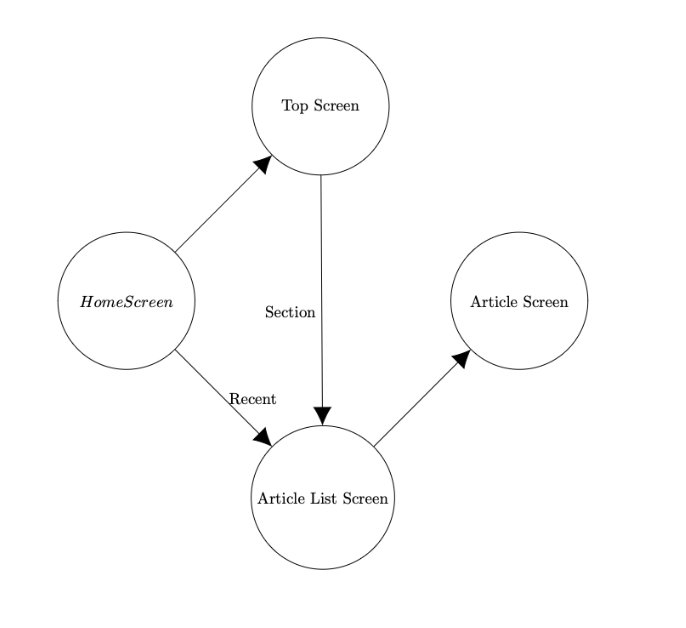

### Step 1: Defining the logic of the Kivy UI and UX.
We have two different API calls to the NYT, the top stories and the recent stories. A user should be able to select one and be taken to the next screen. If a ueser selects the top screen, they have a list of choices: the possible sections to view the top stories. When they make a selection they should see the list of stories which will be generated from the API call using the section they selected. Had the user selected the recent stories on the home screen, we can go directly to the list of stories generated by the "recent stories" api call. From the list of stories screen a user should select one to view in greater detail, taking the user to the article screen. See the UI flow below:

For UX, each screen should be able to scroll to view all possible options and no text should be cut off unless text is too long, in which they should be able to interact with the element to see the rest. 

### Step 2: Defining the content of each screen
The home screen has two selections so it should have two buttons, top and recent.
```
from kivy.uix.screenmanager import Screen
from kivy.uix.boxlayout import BoxLayout
from kivy.uix.button import Button

class HomeScreen(Screen):
    def __init__(self, **kwargs):
        super().__init__(**kwargs)
        layout = BoxLayout(orientation='vertical')
        top_btn = Button(text='Top')
        top_btn.bind(on_press=self.go_to_top)
        recent_btn = Button(text='Recent')
        recent_btn.bind(on_press=self.go_to_recent)
        layout.add_widget(top_btn)
        layout.add_widget(recent_btn)
        self.add_widget(layout)

    def go_to_top(self, instance):
        self.manager.current = 'top'

    def go_to_recent(self, instance):
        self.manager.current = 'articles'
        self.manager.get_screen('articles').list_articles(None)
```
The top screen should have a button for each possible section a user can query.
```
from kivy.uix.screenmanager import Screen
from kivy.uix.scrollview import ScrollView
from kivy.uix.gridlayout import GridLayout
from kivy.uix.button import Button
from kivy.metrics import dp


class TopScreen(Screen):
    def __init__(self, **kwargs):
        super().__init__(**kwargs)
        layout = GridLayout(cols=1, spacing=dp(10), size_hint_y=None)
        layout.bind(minimum_height=layout.setter('height'))
        sections = [
            'arts', 'automobiles', 'business', 'fashion', 'food',
            'health', 'insider', 'magazine', 'movies', 'nyregion', 'obituaries',
            'opinion', 'politics', 'realestate', 'science', 'sports', 'sundayreview',
            'technology', 'theater', 't-magazine', 'travel', 'upshot', 'us', 'world'
        ]

        back_btn = Button(text=' <-- ', size_hint_y=None, height=50)
        back_btn.bind(on_press=self.go_back)
        layout.add_widget(back_btn)

        home_btn = Button(text='FRONT PAGE',size_hint_y=None,height=dp(48))
        home_btn.bind(on_press=lambda instance :self.view_section(Button(text='home')))
        layout.add_widget(home_btn)

        for section in sections:
            btn = Button(text=section, size_hint_y=None, height=dp(48))
            btn.bind(on_press=self.view_section)
            layout.add_widget(btn)

        scroll_view = ScrollView(size_hint=(1, 1))
        scroll_view.add_widget(layout)

        self.add_widget(scroll_view)

    def view_section(self, instance):
        self.manager.current = 'articles'
        self.manager.get_screen('articles').list_articles(instance.text)

    def go_back(self, instance):
        self.manager.current = self.manager.previous()
```
The article list screen should have a button for each possible article. The button text should be the start of the article title. 
```
from kivy.uix.screenmanager import Screen
from kivy.uix.scrollview import ScrollView
from kivy.uix.gridlayout import GridLayout
from kivy.uix.button import Button
from kivy.metrics import dp
from NYTConnector import NYTConnector

class ArticleListScreen(Screen):
    def __init__(self, **kwargs):
        super().__init__(**kwargs)
        self.layout = GridLayout(cols=1, spacing=dp(10), size_hint_y=None)
        self.layout.bind(minimum_height=self.layout.setter('height'))

        self.scroll_view = ScrollView(size_hint=(1, 1))
        self.scroll_view.add_widget(self.layout)

        self.add_widget(self.scroll_view)
        self.back_btn = Button(text=' <-- ', size_hint_y=None, height=50)
        self.back_btn.bind(on_press=self.go_back)
        self.layout.add_widget(self.back_btn)
        self.conn = NYTConnector()
        self.dyn_widgets = []

    def list_articles(self, section):
        for widget in self.dyn_widgets:
            self.layout.remove_widget(widget)
        self.dyn_widgets=[]

        if section is None:
            articles_df = self.conn.get_recent_stories()
        else:
            articles_df = self.conn.get_top_stories(section)
        if articles_df is None:
            btn = Button(text='No Articles')
            self.layout.add_widget(btn)
            self.dyn_widgets.append(btn)
            return
        for _, row in articles_df.iterrows():
            btn = Button(text=row['title'], size_hint_y=None, height=dp(48), halign='left')
            btn.shorten = True 
            btn.shorten_from = 'right' 
            btn.padding = (dp(0.1), 0) 
            btn.text_size = (btn.width, None) 
            btn.bind(size=lambda instance, value: setattr(instance, 'text_size', (instance.width, None)),on_press=lambda instance, title=row['title'], url=row['url'], abstract=row['abstract'], item_type=row['item_type']: self.view_article(instance, title, url, abstract, item_type))
            self.layout.add_widget(btn)
            self.dyn_widgets.append(btn)

    def view_article(self, instance, title, url, abstract, item_type):
        print(f"Title: {title}, URL: {url}, Abstract: {abstract}, Item Type: {item_type}")
        self.manager.current = 'article'
        self.manager.get_screen('article').display_article(title, url, abstract, item_type)

    def go_back(self, instance):
        self.manager.current = self.manager.previous()
```
The article screen should show the article title, the type of article (article, podcast, interactive, etc...) and the abstract of the article. If the user wants to add this article to their reading list, we also need a button for that.
```
from kivy.uix.screenmanager import Screen
from kivy.uix.gridlayout import GridLayout
from kivy.uix.label import Label
from kivy.uix.button import Button
from kivy.uix.scrollview import ScrollView
from .objects.line_separator import LineSeparator
import paho.mqtt.publish as publish
import pandas as pd
import json


class ArticleScreen(Screen):
    def __init__(self, **kwargs):
        super().__init__(**kwargs)
        self.layout = GridLayout(cols=1, spacing=10, size_hint_y=None)
        self.layout.bind(minimum_height=self.layout.setter('height'))

        scroll_view = ScrollView(size_hint=(1, 1), do_scroll_x=False, do_scroll_y=True, scroll_type=['bars', 'content'])

        self.back_btn = Button(text=' <-- ', size_hint_y=None, height=50)
        self.back_btn.bind(on_press=self.go_back)
        self.layout.add_widget(self.back_btn)

        self.title_label = Label(color=(1, 1, 1, 1), size_hint_y=None, halign='left', valign='middle')
        self.title_label.bind(size=self.update_text_size)
        self.layout.add_widget(self.title_label)
        self.layout.add_widget(LineSeparator())

        self.item_type_label = Label(color=(1, 1, 1, 1), size_hint_y=None, halign='left', valign='middle')
        self.item_type_label.bind(size=self.update_text_size)
        self.layout.add_widget(self.item_type_label)
        self.layout.add_widget(LineSeparator())

        self.abstract_label = Label(color=(1, 1, 1, 1), size_hint_y=None, halign='left', valign='middle')
        self.abstract_label.bind(size=self.update_text_size)
        self.layout.add_widget(self.abstract_label)
        self.layout.add_widget(LineSeparator())

        self.add_to_list_btn = Button(text='Add to Reading List', size_hint_y=None, height=50)
        self.add_to_list_btn.bind(on_press=self.handle_add_to_list)
        self.layout.add_widget(self.add_to_list_btn)

        scroll_view.add_widget(self.layout)
        self.add_widget(scroll_view)

        self.url = None
        self.title = None

    def update_text_size(self, instance, value):
        padding = 20
        instance.text_size = (instance.width - padding, None)

    def display_article(self, title, url, abstract, item_type):
        self.title_label.text = f"Title: {title}"
        self.item_type_label.text = f"Type: {item_type}"
        self.abstract_label.text = f"Abstract: {abstract}"
        self.url = url
        self.title = title

    def handle_add_to_list(self, instance):
        if self.title and self.url:
            self.add_to_reading_list(self.title, self.url)

    def go_back(self, instance):
        self.manager.current = self.manager.previous()

    def add_to_reading_list(self, title, url):
        msg = {'title': title, 'url': url}
        msg = json.dumps(msg).encode('utf-8')
        publish.single("devices/b827eb309ede/news/", msg, hostname="34.207.111.28", port=50001)
```
I added a line separator to make it look a little nicer. 
```
from kivy.uix.gridlayout import GridLayout
from kivy.graphics import Color, Rectangle

class LineSeparator(GridLayout):
    def __init__(self, **kwargs):
        super(LineSeparator, self).__init__(size_hint_y=None, height=1, cols=1, **kwargs)
        with self.canvas.before:
            Color(0.7, 0.7, 0.7, 1)
            self.rect = Rectangle(size=self.size, pos=self.pos)
        self.bind(pos=self.update_rect, size=self.update_rect)

    def update_rect(self, *args):
        self.rect.pos = self.pos
        self.rect.size = self.size
```
On each screen there should be the option to go back to the previous screen, so there is a back button at the top. 

### Step 3: Building the App:
The tree structure for the app was defined as:
```
.
├── app.py
├── NYTConnector.py
└── screens
    ├── article_list_screen.py
    ├── article_screen.py
    ├── home_screen.py
    ├── objects
    │   └── line_separator.py
    └── top_screen.py
```
The main app, app.py builds the screen manager, and runs the app. 
```
from kivy.app import App
from kivy.uix.screenmanager import ScreenManager
from screens.home_screen import HomeScreen
from screens.top_screen import TopScreen
from screens.article_list_screen import ArticleListScreen
from screens.article_screen import ArticleScreen

class MyApp(App):
    def build(self):
        sm = ScreenManager()
        sm.add_widget(HomeScreen(name='home'))
        sm.add_widget(TopScreen(name='top'))
        sm.add_widget(ArticleListScreen(name='articles'))
        sm.add_widget(ArticleScreen(name='article'))
        return sm

if __name__ == '__main__':
    MyApp().run()
```

### Step 4: Integrating the Backend Logic
Notice the the logic to handle whether the ArticleListScreen should display the top stories for a section or recent stories needs to be defined. On the home screen, when the recent button is selected, it triggers a call to the article list screen with `None` as the section argument to the `list_articles` function. 

In the ArticleScreen, we integrate mqtt to send to the EC2 instance. A json with the article title and url is created and is encoded in utf-8 for mqtt message payload.


